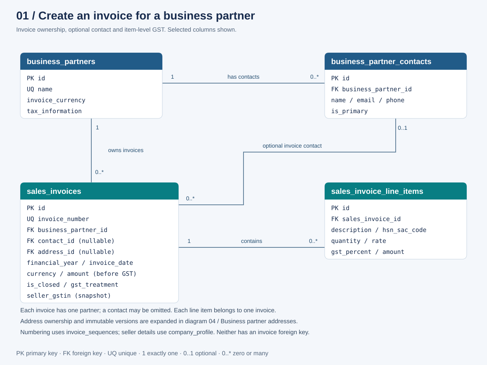
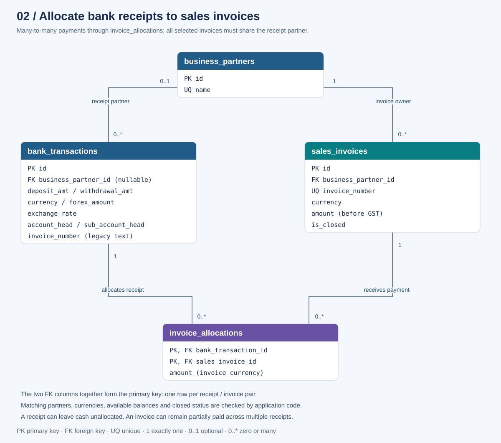
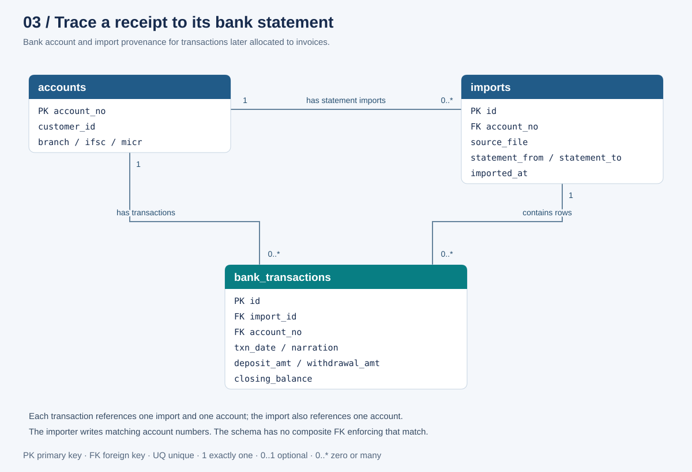

# Bank statement classification: entity relationship diagrams

These diagrams describe the implemented SQLite schema, including the allocation
migration. They are split by use case and show selected columns to keep each
view readable. Each SVG is standalone, scalable, and can be opened in a browser
or embedded in another document.

## 1. Create an invoice



[Open the invoice setup SVG](diagrams/invoice-setup.svg).

| Parent | Child | Relationship |
| --- | --- | --- |
| `business_partners` | `sales_invoices` | A partner has zero or many invoices. Each invoice requires one partner. |
| `business_partners` | `business_partner_contacts` | A partner has zero or many contacts. Each contact requires one partner. |
| `business_partner_contacts` | `sales_invoices` | A contact can appear on zero or many invoices. An invoice has zero or one contact. |
| `sales_invoices` | `sales_invoice_line_items` | An invoice has zero or many stored line items. Each item requires one invoice. The creation UI requires line items. |

The invoice's `amount` is the sum of line-item `amount` values **before GST**.
Each line item stores its own `gst_percent`; there is no separate GST table.
`currency` belongs to the invoice; `business_partners.invoice_currency` supplies
a default in the user interface.

The contact foreign key proves that the contact exists. It does not by itself
prove that the selected contact belongs to the invoice's partner. The diagram
shows the actual foreign keys, not an additional composite ownership constraint.

Two supporting tables are intentionally omitted from the connected diagram:

| Table | Key and purpose | Relationship to invoices |
| --- | --- | --- |
| `invoice_sequences` | PK `financial_year`; `last_number` tracks numbering within a financial year. | Used by invoice creation code. `sales_invoices.financial_year` is not a foreign key. |
| `company_profile` | Singleton PK `id`, constrained to 1; seller name, address and tax/contact details. | Read when rendering invoices; no invoice foreign key or per-invoice seller snapshot. |

## 2. Allocate a receipt to one or more invoices



[Open the receipt allocation SVG](diagrams/receipt-allocation.svg).

`invoice_allocations` resolves the many-to-many relationship between
`bank_transactions` and `sales_invoices`:

- One receipt can pay several invoices.
- One invoice can receive several receipts.
- Each allocation references exactly one receipt and exactly one invoice.
- The composite primary key is `(bank_transaction_id, sales_invoice_id)`.
  There is no separate allocation ID, and a pair cannot appear twice.
- `amount` is positive and expressed in the invoice currency.

A bank transaction may have no business partner while it is unclassified.
Once it has invoice allocations, application validation requires a partner and
`account_head = 'Sales Invoice'`. All allocated invoices must belong to that
partner. This matching-partner rule is not a composite database foreign key.

### Example: combined and partial receipts

Both invoices below belong to partner 1 and use INR. Each contains a base amount
of 100 and GST of 18, so each expects 90 in cash under the configured rule.

| Bank transaction | Sales invoice | Allocation amount |
| --- | --- | ---: |
| Receipt 101: deposit 150 | Invoice 11 | 90 |
| Receipt 101: deposit 150 | Invoice 12 | 60 |
| Receipt 102: deposit 20 | Invoice 12 | 20 |

These are three rows in `invoice_allocations`. Invoice 11 is settled. Invoice 12
has received 80 and has 10 outstanding. Receipt 101 demonstrates several invoices
on one payment; invoice 12 demonstrates several payments against one invoice.
An invoice belonging to partner 2 cannot be added to receipt 101.

### Stored fields versus calculated balances

| Field | Location | Meaning |
| --- | --- | --- |
| `amount` | Stored in `sales_invoices` | Total before GST. |
| `is_closed` | Stored in `sales_invoices` | Manual flag preventing new or changed allocations. |
| `amount` | Stored in `invoice_allocations` | Cash allocated to this invoice from this receipt. |
| `expected_receipt` | Calculated in the invoice API response | INR: round invoice amount times 0.90 to two decimals. Other currencies: rounded invoice amount. |
| `received_amount` | Calculated in the invoice API response | Rounded sum of allocations for the invoice. |
| `outstanding_amount` | Calculated in the invoice API response | Rounded maximum of zero and expected minus received. |
| `is_settled` | Calculated in the invoice API response | True when outstanding equals zero. |

For the requested INR example, `100 + 18 GST = 118` invoiced, with
`118 - 18 GST - 10 TDS = 90` expected cash. The implementation uses the stored
base of 100 directly and multiplies it by 0.90. The 10% rate is fixed in code;
there is no stored per-invoice TDS rate or tax-posting table.

Partial payments do not trigger any tolerance settlement or write-off.
Even an outstanding balance of 0.50 remains open.

### Closing and reopening

Closing an invoice changes `is_closed`; it does not delete its allocations or
set its outstanding balance to zero. Existing links can be saved unchanged.
New links and changes to retained allocation amounts are rejected while closed.
Explicit unlinking is still possible through allocation replacement. Reopening
allows new allocations again, subject to available balance.

The user interface suggests invoices for the selected partner that are neither
closed nor settled. Links already present on the current transaction stay
visible, including links to closed or settled invoices. Closing and settlement
are independent: a manually closed invoice may still have an outstanding amount.

### Integrity and accounting scope

| Enforced by schema | Enforced by application |
| --- | --- |
| Allocation foreign keys identify existing transactions and invoices. | All allocated invoices share the selected transaction partner. |
| Composite PK prevents duplicate receipt/invoice pairs. | Amounts are finite, positive and have at most two decimal places. |
| `CHECK(amount > 0)` rejects nonpositive allocations. | Total allocated cannot exceed the receipt or each invoice's available balance. |
| `is_closed` defaults to false and cannot be null. | Closed invoices reject new or changed links; existing amounts may be retained. |
| Invoice partner is required; transaction partner is nullable. | Allocations require a positive deposit, no positive withdrawal, and Sales Invoice classification. |

For INR, the receipt limit is `deposit_amt`, with blank or INR bank currency.
For foreign invoices, the bank currency must match and the limit is the positive
`forex_amount`. `exchange_rate` is stored metadata, not a conversion performed by
the allocation function. Unallocated cash remains on the receipt.

Classification and allocation replacement run in one database transaction.
Validation failures leave the previous allocations intact. Omitted or null
`allocations` preserve existing links; an empty array removes them. Invoice
partner, currency and line items cannot change while financial links exist.

The allocation table is a receipt subledger. The current implementation does
not contain general-ledger debit/credit journals, separate GST/TDS postings,
or an immutable history of replaced allocations. The diagrams do not imply
those additional tables exist.

`bank_transactions.invoice_number` is legacy/display text, not a foreign key.
It is populated from linked invoice numbers when allocations are saved. Old
text-only references are preserved but do not count toward received balances
until explicitly allocated.

## 3. Trace a receipt to its imported statement



[Open the statement import SVG](diagrams/statement-import.svg).

| Parent | Child | Relationship |
| --- | --- | --- |
| `accounts` | `imports` | One account can have zero or many statement imports. Each import requires one account. |
| `imports` | `bank_transactions` | One import can contain zero or many transactions. Each transaction requires one import. |
| `accounts` | `bank_transactions` | One account can have zero or many transactions. Each transaction directly references one account. |

`imports.source_file` and statement dates provide provenance for a bank receipt.
`bank_transactions.import_id` identifies the imported statement. The transaction
also stores `account_no` directly. The importer writes matching account numbers,
but the two independent foreign keys do not enforce that match themselves.

## Diagram notation and maintenance

`PK` means primary key, `FK` foreign key, and `UQ` unique. Cardinalities appear
at each end of a relationship: `1` exactly one, `0..1` optional, and `0..*`
zero or many. For example, `1` near a parent and `0..*` near its child means each
child has one parent, while a parent may have many children. All drawn connectors
represent declared foreign keys. Blue cards show partner or banking context,
teal cards show invoices or transaction details, and purple shows allocations.

The source of truth is [core/db.go](../core/db.go) for the base schema and invoice
persistence, and [core/allocations.go](../core/allocations.go) for the allocation
schema, closure migration and balance rules. The diagrams describe the schema
after startup migrations, rather than assuming a local database is up to date.

Regenerate the SVGs using Python's standard library:

```powershell
python docs/diagrams/generate_erd.py
```

The [generator](diagrams/generate_erd.py) validates SVG XML before writing it.
For user steps and the request payload, see
[Bank receipt allocation](bank-receipt-allocation.md).
