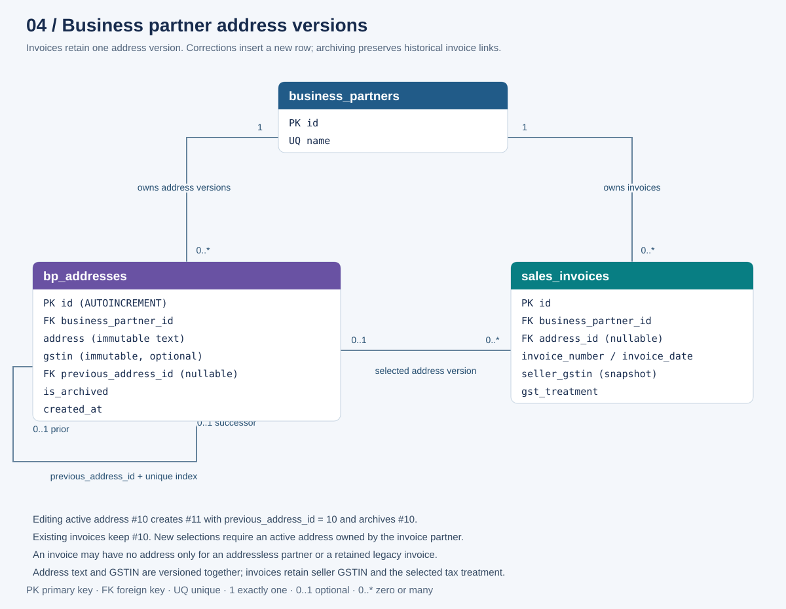

# Business partner addresses and invoice history

Business partners can have multiple billing addresses. Each saved address has
its own auto-incrementing ID in `bp_addresses`. Address text is versioned rather
than overwritten, and invoices reference the selected address ID.



[Open the standalone SVG](diagrams/business-partner-addresses.svg). The complete
[use-case ERDs](bank-statement-classification-erd.md) also show contacts, invoice
line items and receipt allocations.

## Using the feature

1. Create or edit a business partner. Use **Add address** for each location.
2. Save the partner to persist all address changes together. A new location gets
   a new ID. Editing a saved active address or its GSTIN creates a new version and archives
   the previous version. Cancelling partner editing discards pending changes.
3. Use **Archive on save** to retire an address without replacing it. Archived
   versions remain visible in the partner's address list and cannot be edited
   or reactivated through the partner API. Add an independent address if needed.
4. Raise an invoice, select the business partner, and choose an active billing
   address. The first active address (lowest address ID) is selected automatically,
   including when several active addresses exist. You can choose another active
   address from the dropdown.
5. Existing invoices continue to display and print their original address even
   after it is archived. Invoice editing may retain that archived address;
   switching to a different address requires an active address of the same
   partner.

Contacts remain optional. Each entered address must contain nonblank text.
A partner can be saved without addresses; new invoices for such a partner may
have no address. Once a partner has address records, a new invoice requires an
active address. If all addresses are archived, add an active address first.
An existing invoice with no address may retain that absence when its partner
is unchanged. Clearing a previously selected invoice address is rejected.

## Data model

| Table / column | Meaning |
| --- | --- |
| `bp_addresses.id` | INTEGER primary key, AUTOINCREMENT; identifies a particular address version. |
| `bp_addresses.business_partner_id` | Required FK to `business_partners.id`; the address owner. |
| `bp_addresses.gstin` | Optional GSTIN for this address version. Changing it creates a new version, even if address text stays the same. |
| `bp_addresses.address` | Required, nonblank address text. Immutable after insertion. |
| `bp_addresses.previous_address_id` | Optional self-reference to the version replaced by this row. A unique index prevents multiple immediate successors. |
| `bp_addresses.is_archived` | Defaults to false; archived addresses cannot be newly selected on invoices. |
| `bp_addresses.created_at` | Timestamp assigned on insertion. |
| `sales_invoices.address_id` | Nullable FK to the precise address version used by the invoice. |
| Invoice API `billing_address` | Read-only output resolved from `address_id`; used in invoice PDF output. |
| Partner `billing_address` | Compatibility scalar containing the first active address by ID, or an empty string. |

SQLite triggers reject edits to stored address text, GSTIN, ownership, version ancestry,
ID or creation timestamp. Invoice insert/update triggers reject cross-partner
address references and new selections of archived versions. Retaining the same
archived address on the same invoice partner is allowed. Foreign keys protect
referenced address rows from deletion. Foreign-key enforcement is enabled on
every pooled application connection, rather than only the initial connection.

The application saves partner fields, contacts and address versions in one
transaction. Invalid addresses or an ownership conflict roll back the entire
save. Existing contact IDs are retained during updates, so editing addresses
also works when an invoice references one of the partner's contacts. Removing
an invoice-referenced contact is still prohibited by its foreign key.

Address collection updates do not delete omitted rows. To retire a saved address,
explicitly mark it archived. A partner with invoices still cannot be deleted;
otherwise deleting the partner cascades to its address rows.

## Versioning example

Initially, partner 7 has address 10, `Old office`, and invoice 25 uses address 10.
Updating address 10 to `New office` produces:

| ID | Partner | Address | Previous ID | Archived |
| --- | --- | --- | --- | --- |
| 10 | 7 | Old office | NULL | true |
| 11 | 7 | New office | 10 | false |

Invoice 25 keeps `address_id = 10`. A new invoice can use address 11. Updating
address 11 again creates a third version; it does not overwrite either row.
Archiving an unchanged address only changes its flag and does not create a new
version.

## API

The existing business partner endpoints accept an `addresses` array alongside
the partner's other fields. GET/list/create/update responses include all saved
versions, including their IDs, timestamps and archive flags.

Create a partner with two independent addresses:

```json
{
  "name": "Example Customer",
  "invoice_currency": "INR",
  "contacts": [],
  "addresses": [
    { "address": "Main office, Bengaluru", "is_archived": false },
    { "address": "Branch office, Pune", "is_archived": false }
  ]
}
```

For a partner update, send the existing ID with revised text to create its next
version, together with the usual partner fields and contact data:

```json
{
  "name": "Example Customer",
  "invoice_currency": "INR",
  "contacts": [],
  "addresses": [
    { "id": 10, "address": "New main office, Bengaluru", "is_archived": false }
  ]
}
```

To archive without replacement, send the stored text unchanged and set
`is_archived` to true. Rows with no ID create independent addresses. Clients
cannot choose `previous_address_id` for new rows; the server sets it when
versioning an existing row. Duplicate IDs, another partner's IDs, blank text,
and edits to archived versions are rejected. Repeating a stale edit against
an already archived version is rejected; reload the saved partner first.

An omitted/null `addresses` array preserves saved versions. An empty array also
leaves saved versions intact. Legacy clients that supply a changed, nonempty
`billing_address` without `addresses` create a version of the first active
address (or create the first address). An empty legacy scalar does not erase
address history. Modern clients should use the array.

Sales invoice create/update payloads include `address_id`. Client-provided
invoice `billing_address` text is ignored; the server resolves the selected ID.
Invalid address selections return HTTP 400. An unchanged archived ID is valid
on update, but using it on a new invoice is rejected.

## Migration and compatibility

The startup migration creates `bp_addresses`, adds the nullable invoice FK,
and moves each nonblank legacy partner billing address into an initial row.
Existing invoices for that partner reference the migrated row. Blank legacy
addresses leave invoice address IDs null. All these steps run atomically, and
restarting does not create duplicates or change links to archived versions.

The old system stored only the partner's current billing address. The migration
can preserve only that available value; it cannot reconstruct addresses that
were changed before versioning existed. After migration, invoices use their
address ID exclusively and never fall back to the partner's current address.

No live customer records are changed during automated testing; migration and
history tests run against temporary SQLite databases. Restart the backend to
apply the migration to the application's database.

## Verification and sources

Go tests cover multiple addresses, version ancestry, automatic and manual
archiving, historical invoice reads, new/edited invoice selection validation,
cross-partner rejection, immutable database rows, stable contact IDs, atomic
rollback, API responses, and idempotent legacy migration. Frontend tests cover
address drafts, active-only selection, retained archived addresses and historical
invoice PDF output.

```powershell
go test ./core ./handlers .
cd frontend
npm.cmd run build -- --configuration development
npm.cmd test -- --watch=false --karma-config=karma.browser-check.cjs --include=src/app/business-partners/**/*.spec.ts --include=src/app/sales-invoices/list/list.component.spec.ts
```

Implementation: [address model and migration](../core/bp_addresses.go),
[persistence](../core/db.go), [API handlers](../handlers/api.go), and
[address editor](../frontend/src/app/business-partners/addresses/addresses.component.ts).
Regenerate the ERD SVGs with `python docs/diagrams/generate_erd.py`.

For address-specific GSTIN and invoice tax components, see [GST split rules](invoice-gst.md).
